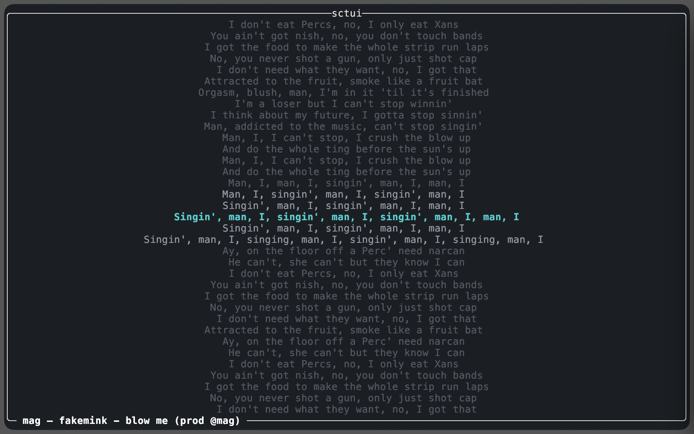

# sctui

a soundcloud client for the terminal


## Installation

<details>
<summary><b>Installation instructions</b></summary>

### macOS / Linux

```sh
curl -fsSL https://raw.githubusercontent.com/Illogicalll/sctui/main/install.sh | sh
```

### Windows

```powershell
irm https://raw.githubusercontent.com/Illogicalll/sctui/main/install.ps1 | iex
```

### Manual download

Grab the archive for your platform from the [latest release](https://github.com/Illogicalll/sctui/releases/latest), extract it and put `sctui` somewhere on your `PATH`.

### From source

Needs [Rust](https://rustup.rs) 1.85+. On Linux, install the ALSA headers first: `sudo apt install libasound2-dev pkg-config`

```sh
cargo install --git https://github.com/Illogicalll/sctui
```

</details>

<details>
<summary><b>Updating</b></summary>

sctui checks GitHub for a newer release every time it starts and asks before installing it. Pass `--no-update-check` to skip the check, or re-run the installer above to update by hand. `sctui --version` shows what you have.

</details>

<details>
<summary><b>Requirements</b></summary>

- **A SoundCloud account.** The free tier is fine.
- **A modern terminal with true colour.** Cover art needs a terminal that supports an image protocol.
- **A font with Unicode block and braille glyphs** for the visualisers. Any Nerd Font, JetBrains Mono or Fira Code works.
- **Linux:** the ALSA runtime (`libasound2`), which every desktop distro ships. PipeWire and PulseAudio work through their ALSA plugin.
- **macOS 11+** or **Windows 10+**.

</details>

## Features

### 🎧 High Quality Ad-Free playback

<p align="center">Stream tracks directly from SoundCloud without the interruptions you would usually experience with a free account on the website</p>

### ✅ Fully Featured

<p align="center">Browse your own Likes, Playlists and Saved Albums as well as the Tracks and Likes of the People you follow</p>

<p align="center"></p>

<p align="center">Search for Tracks, Albums and Playlists to add to your library, as well as new People to follow</p>

<p align="center"></p>

<p align="center">View the activity of everyone you follow to stay up to date with their latest releases or reposts</p>

<p align="center"></p>

### 🔊 Gapless Playback

<p align="center">Enjoy seamless transitions in your favourite albums without the buffering present on SoundCloud Web</p>

### 📻 Stations

<p align="center">When a playlist, album or your likes run out, sctui keeps going with related tracks. Alternatively, pressing Shift + Enter on any track or artist will start a queue of related tracks</p>

### 🎛️ Native Media Integration

<p align="center">The current track shows in your system's media panel with artwork and a live position. The play/pause/ skip buttons on your keyboard, headphones integrate directly</p>

### 🎤 Lyrics

<p align="center">Where available, live lyrics can be displayed in the visualiser (sourced from <a href="https://lrclib.net">LRCLIB</a>)</p>

<p align="center"></p>

### 👁️ Audio Visualiser

<p align="center">Choose from one of 14 modes, from oscilloscopes to spectrums and more...</p>

<p align="center"></p>

<p align="center"></p>

<p align="center">+ 12 more...</p>

<details>
<summary><b>Configuration</b></summary>

Configuration lives in `~/.config/sctui/config.toml` / 
  
### Themes

Press `Shift+O` to pick a colour theme with a live preview: `default`, `tokyonight`, `catppuccin-mocha`, `dracula`, `gruvbox-dark`, `nord`, `solarized-dark`, `one-dark`, `rose-pine`.

### Keybindings

Press `?` to edit bindings in the app: pick an action, `Enter` then press the new key to add it, `Backspace` to unbind, `r` to restore its default.

</details>

## Limitations

### ❌ Playback of Certain Tracks

- Due to SoundCloud API limitations, Go+ tracks are not playable from the application (no matter what account type you have)
- If a creator has disabled off-app streaming, then a track will not be playable via the API

### ❌ Downloads

- Due to the SoundCloud API Terms of Use, the downloads and offline playback is not supported

## Privacy

sctui talks to SoundCloud directly for everything except login. Login and hourly token refresh go through a small relay (source in [`worker/`](./worker)) that adds the app secret and passes SoundCloud's reply straight back without reading or storing it.

Your password never leaves soundcloud.com. You can revoke sctui's access at any time from your SoundCloud settings.

## License

Copyright © Will Murphy <contact@w-murphy.com>

This project is licensed under the MIT license ([LICENSE] or <http://opensource.org/licenses/MIT>)

[LICENSE]: ./LICENSE
