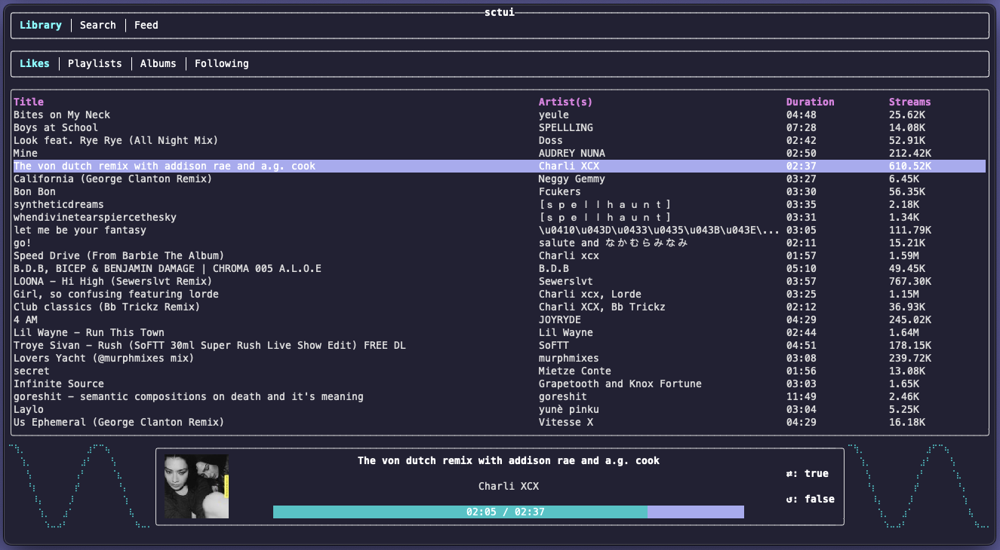
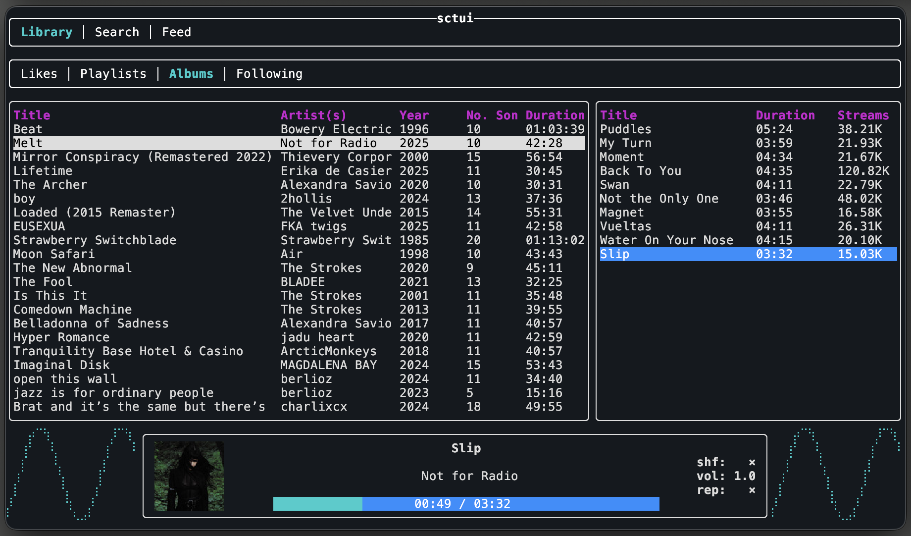
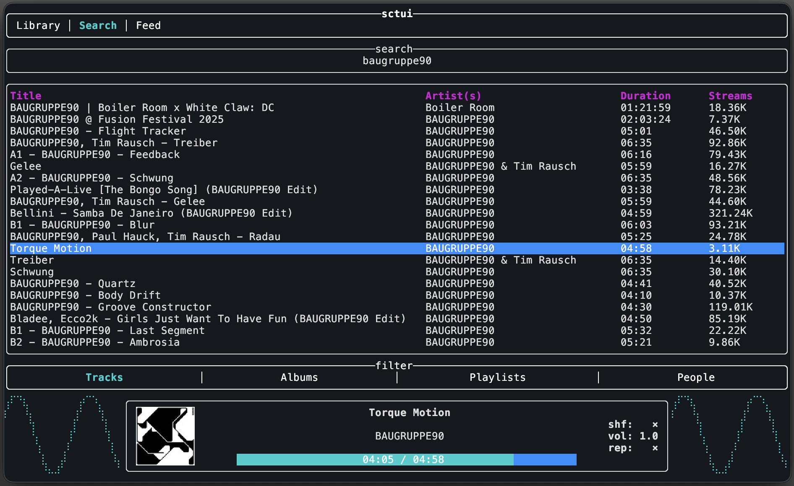
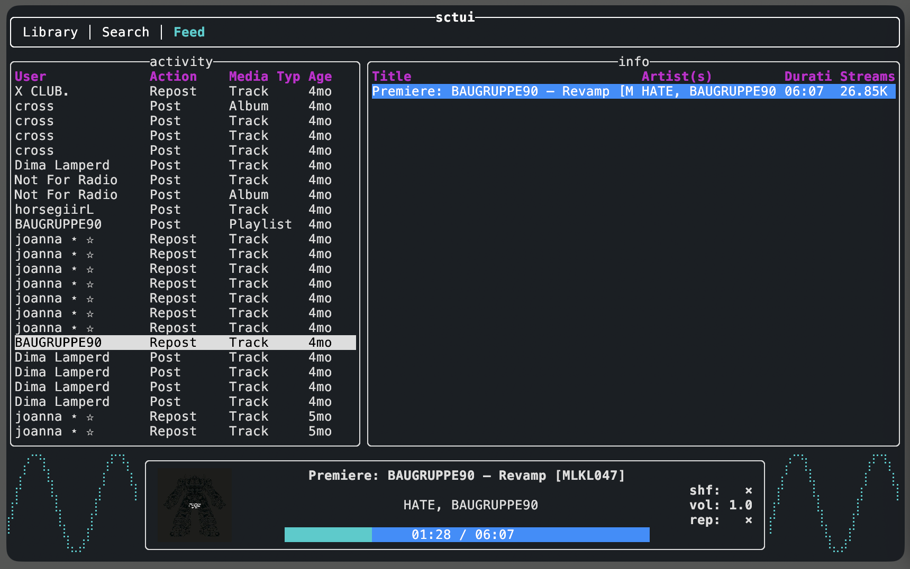
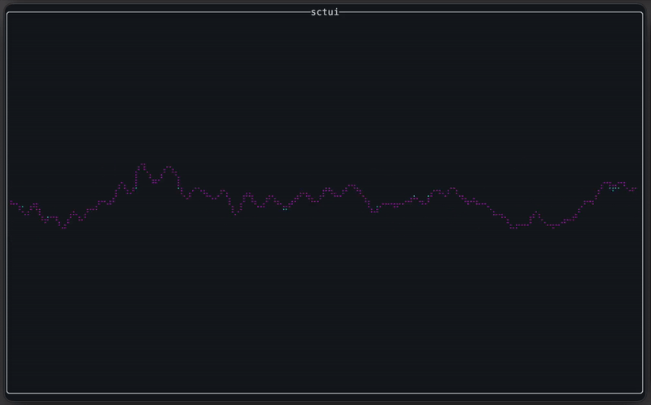
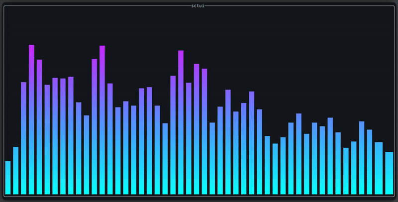

# sctui

a soundcloud client for the terminal



## Installation

<details>
<summary><b>Installation instructions</b></summary>

### macOS / Linux

```sh
curl -fsSL https://raw.githubusercontent.com/Illogicalll/sctui/main/install.sh | sh
```

Downloads the latest release for your platform, verifies its checksum and installs it to `~/.local/bin/sctui`. Set `SCTUI_INSTALL_DIR` to change the location or `SCTUI_VERSION=v0.1.0` to pin a release.

### Windows

```powershell
irm https://raw.githubusercontent.com/Illogicalll/sctui/main/install.ps1 | iex
```

Installs to `%LOCALAPPDATA%\sctui\bin` and adds it to your user `PATH`.

### Manual download

Grab the archive for your platform from the [latest release](https://github.com/Illogicalll/sctui/releases/latest), extract it and put `sctui` somewhere on your `PATH`.

| Platform | File |
|---|---|
| macOS (Apple Silicon) | `sctui-aarch64-apple-darwin.tar.gz` |
| macOS (Intel) | `sctui-x86_64-apple-darwin.tar.gz` |
| Linux (x86_64) | `sctui-x86_64-unknown-linux-gnu.tar.gz` |
| Linux (ARM64) | `sctui-aarch64-unknown-linux-gnu.tar.gz` |
| Windows (x86_64) | `sctui-x86_64-pc-windows-msvc.zip` |

### From source

Needs [Rust](https://rustup.rs) 1.85 or newer. On Linux, install the ALSA headers first: `sudo apt install libasound2-dev pkg-config` (Debian/Ubuntu) or `sudo dnf install alsa-lib-devel` (Fedora).

```sh
cargo install --git https://github.com/Illogicalll/sctui
```

</details>

<details>
<summary><b>Updating</b></summary>

sctui checks GitHub for a newer release every time it starts and asks before installing it: `y` updates in place and relaunches, `n` carries on, `s` stops asking about that version. Pass `--no-update-check` to skip the check, or re-run the installer above to update by hand. `sctui --version` shows what you have.

</details>

<details>
<summary><b>Requirements</b></summary>

- **A SoundCloud account.** The free tier is fine.
- **A modern terminal with true colour.** Cover art needs a terminal that supports an image protocol: kitty, WezTerm, Ghostty, iTerm2 or foot. Any other terminal falls back to block-character art.
- **A font with Unicode block and braille glyphs** for the visualisers. Any Nerd Font, JetBrains Mono or Fira Code works.
- **Linux:** the ALSA runtime (`libasound2`), which every desktop distro ships. PipeWire and PulseAudio work through their ALSA plugin.
- **macOS 11+** or **Windows 10+**.

</details>

## Features

### 🎧 High Quality Ad-Free playback

<p align="center">Stream tracks directly from SoundCloud without the interruptions you would usually experience with a free account on the website</p>

### ✅ Fully Featured

<p align="center">Browse your own Likes, Playlists and Saved Albums as well as the Tracks and Likes of the People you follow</p>

<p align="center"></p>

<p align="center">Search for Tracks, Albums and Playlists to add to your library, as well as new People to follow</p>

<p align="center"></p>

<p align="center">View the activity of everyone you follow to stay up to date with their latest releases or reposts</p>

<p align="center"></p>

### 🔊 Gapless Playback

<p align="center">Enjoy seamless transitions in your favourite albums without the buffering present on SoundCloud Web</p>

### 📻 Stations

<p align="center">Press Shift + Enter on any track to start a station: it plays, then SoundCloud's related tracks follow. When a playlist, album or your likes run out, sctui keeps going with related tracks instead of stopping</p>

### 📝 Playlist Management

<p align="center">Shift + T adds any track to one of your playlists, or to a brand new one. In your own playlists, Shift + X removes a track and Shift + Z deletes the playlist, each behind a confirmation</p>

### 🕘 History

<p align="center">Shift + P opens everything you have listened to this session, newest first. Pick any track to hear it again</p>

### 👁️ Audio Visualiser

<p align="center">Choose from one of 13 modes, from oscilloscopes to spectrums and more...</p>

<p align="center"></p>

<p align="center"></p>

<p align="center">and more...</p>

## Limitations

### ❌ Playback of Go+ Tracks

- Due to SoundCloud API limitations, Go+ tracks are not playable from the application

### ❌ Downloads

- Due to the SoundCloud API Terms of Use, the download and offline playback of tracks is not supported

## Privacy

sctui talks to SoundCloud directly for everything except login. Login and hourly token refresh go through a small relay (source in [`worker/`](./worker)) that adds the app secret and passes SoundCloud's reply straight back without reading or storing it. Your password never leaves soundcloud.com. You can revoke sctui's access at any time from your SoundCloud settings.

## Dev Diary

find the dev diary to follow along the development ~~struggle~~ process [here](./DEV_DIARY.md)

## License

Copyright (c) Will Murphy <contact@w-murphy.com>

This project is licensed under the MIT license ([LICENSE] or <http://opensource.org/licenses/MIT>)

[LICENSE]: ./LICENSE
