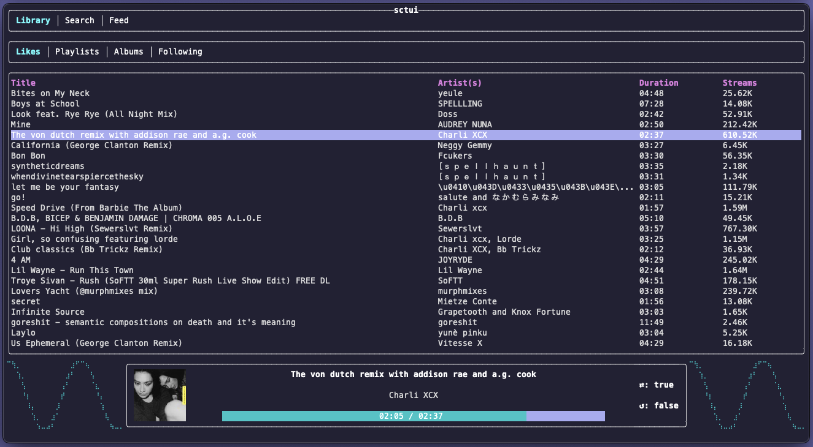

# sctui

a soundcloud client for the terminal

## Features

### 🎧 High Quality Ad-Free playback

Stream tracks directly from SoundCloud without the interruptions you would usually experience with a free account on the website

### ✅ Fully Featured

Browse your own Likes, Playlists and Saved Albums as well as the Tracks and Likes of the People you follow

Search for Tracks, Albums and Playlists to add to your library, as well as new People to follow

🚧 Feature Coming Soon 🚧

View the activity of everyone you follow to stay up to date with their latest releases or reposts

🚧 Feature Coming Soon 🚧

### 🔊 Gapless Playback

Enjoy seamless transitions in your favourite albums without the buffering present on SoundCloud Web

### 👁️ Audio Visualiser

View the waveforms of your favourite music in an oscilloscope-style visualisation mode

(maybe more modes coming soon..)

## Limitations

### ❌ Playback of Go+ Tracks

- Due to SoundCloud API limitations, Go+ tracks are not playable from the application

### ❌ Downloads

- Due to the SoundCloud API Terms of Use, the download and offline playback of tracks is not supported

## Dev Diary

find the dev diary to follow along the development ~~struggle~~ process [here](./DEV_DIARY.md)

## License

Copyright (c) Will Murphy <contact@w-murphy.com>

This project is licensed under the MIT license ([LICENSE] or <http://opensource.org/licenses/MIT>)

[LICENSE]: ./LICENSE
